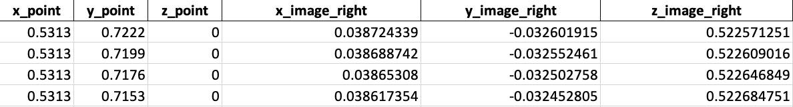

# Retina model
> A pin-hole model of fish's retina which transforms bottom-projected stimuli into retinal space

## Examples of retina images 


## Setup
* Install the latest version of Python 3. We are using the Anaconda distribution
* Some additional packages needed: 
    * skimage - an open source Python package designed for image preprocessing; 
      ```
      # Update pip
      python -m pip install -U pip
      # Install scikit-image
      python -m pip install -U scikit-image
      ```   
    * openpyxl  - a Python library to read/write Excel 2010 xlsx/xlsm/xltx/xltm files; 
      ```
      pip install openpyxl      
      ```
   
    * pandas - a software library written for the Python programming language for data manipulation and analysis; 
      ```
      pip install pandas
      ```

## Usage
* Put in parameters for the visual stimuli in the file "eye_model_curve.py" as follow:
   ```
   ratio = 1### how big is one axis compared to the other.
   minor_p = 0.225  #minor axis of the dot   (cm)
   major_p = minor_p * ratio #major axis of the dot  (cm)
   dist_to_center =  [0.9]   # distance from the fish's head to the center of the stimulus (cm) 
   angle_to_fish = [20] #angle between Oy and the line connecting the closet point of the ellipse to the fish (deg) 
   angle_ver = [20]  # angle from Oy to the major axis of the ellipse  (deg)
   location = r'WHERE YOU WANT TO SAVE THE OUTPUT DATA FILES'
   labels = "vertical_constant" ##labels of stimulus. Eg: vertical ellipse or horizontal ellipse
   ```
   
* If you want to also control for the parameters of the fish's eyes, additional parameters can be adjusted in the file "additional_input.py":
   ```
   arena_radius_real = 9.2/2   # (cm)
   distance_xy_right = 0.9  # (cm)
   distance_xy_left = 0.9  # (cm)                                          
   dist_btw_eye = 0.12 # distance between the two eyes        #(cm)
   body_len = 0.5 #the length of the fish's body              #(cm)
   y_leye = 0 # y position of the left eye                    #(cm)
   x_leye = -0.06# x position of the left eye                 #(cm)
   eye_rad = 0.045 # fish eye's radius                         #(cm)
   h = 0.5 # the z position of the fish from the ground      #(cm)
   x_reye = x_leye + dist_btw_eye #x position of  the right eye    #(cm)
   y_reye = y_leye #y position of the right eye               #(cm)
   z_reye = z_leye = h #the z position of the fish from the ground  #(cm)
   angle_retina = 26.5 #angle made btw the normal vector of retina and the horizontal (deg)
   retina_field = 163 (deg)
   ```
 * Then hit the 'Run file' button
   
## Output clarification
* Example of output parameters:
   * 'ratio': aspect ratio of the visual stimulus
   * 'minor_p': the length (cm) of the visual stimulus' minor axis 
   * 'major_p': the length (cm) of the visual stimulus' major axis 
   * 'dist_to_center': the distance (cm) from the center of the visual stimulus to the midpoint of the line segment connecting two eye balls' centers
   * 'angle_to_fish': angle (deg) from the vertical axis (Oy) to the line segment connecting the fish to the visual stimulus's center (clockwise)
   * 'angle_ver' : angle (deg) from the vertical axis (Oy) to the major axis of the visual stimulus (clockwise)
   * 'x_eye_ball_left', 'y_eye_ball_left', 'z_eye_ball_left': are coordinates (cm) of the left/ right eye ball's center 
   * 'x_center_retina_left', 'y_center_retina_left' : are coordinates (cm) of the left/right retina center
   * 'eye_rad': eye ball's radius (cm) 
   * 
* Example of output data:
   * 'x_point', 'y_point', 'z_point' are coordinates of points on the contour of the visual stimuli
   * 'x_image_right', 'y_image_right', 'z_image_right' are coordinates of points on the contour of the stimuli's retina images on the right retina
   * 'x_image_left', 'y_image_left', 'z_image_left' are coordinates of points on the contour of the stimuli's retina images on the left retina
   * 

* Example of output properties: 
   * 'Semi major': the length (cm) of major axis of a stimulus's retina image
   * 'Semi minor': the length (cm) of major axis of a stimulus's retina image
   * 'Image_area': the area (cm2) of the stimulus's retina image 
   * 'Aspect ratio': the aspect ratio of the stimulus's retina image
   * 'Distance to retina center': the distance(cm) from the retina center to the stimulus's retina image
   * 'Azimuth': the azimuth angle position of the stimulus's retina image
   * 'Altitude': the altitude angle position of the stimulus's retina image
